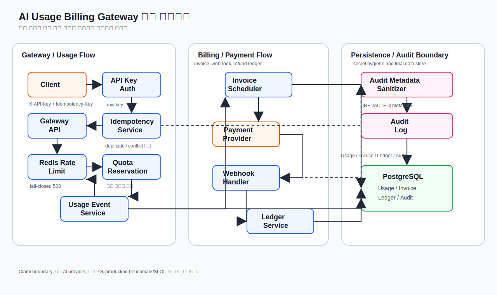

# Architecture

이 문서는 AI Usage Billing Gateway의 README 수준 전체 구조를 설명합니다.
목표는 API key 인증부터 gateway idempotency, quota reservation, invoice, webhook,
ledger, audit persistence까지 이어지는 핵심 흐름과 검증 경계를 한 번에 확인하는 것입니다.

> 이 다이어그램은 구현된 핵심 흐름과 검증 대상 경계를 설명하기 위한 단순화된 구조도이며, 운영 배포 토폴로지나 production SLO를 주장하지 않습니다.

## 핵심 흐름

1. Client는 `X-API-Key`와 `Idempotency-Key`로 Gateway API를 호출합니다.
2. API Key Auth는 raw key를 저장하지 않고 prefix/hash 기반으로 인증합니다.
3. Gateway API는 retry idempotency를 먼저 확인한 뒤 Redis Rate Limit과 Quota Reservation을 통과합니다.
4. Quota Reservation은 Usage Event Service의 usage 저장과 같은 경계에서 월별 사용량을 예약합니다.
5. Usage Event Service는 Usage 데이터를 PostgreSQL에 기록합니다.
6. Invoice Scheduler는 저장된 usage와 subscription 정보를 기준으로 invoice 생성을 재시도 가능하게 수행합니다.
7. Payment Provider의 webhook은 Webhook Handler에서 signature, duplicate, conflict 경계를 통과합니다.
8. Ledger Service는 invoice/payment/refund 흐름을 append-only ledger entry로 기록합니다.
9. Audit Metadata Sanitizer는 secret 계열 metadata를 `[REDACTED]` 처리한 뒤 Audit Log에 저장합니다.

## 데이터 경계

| 데이터 | 최종 저장 위치 | 설명 |
| --- | --- | --- |
| Usage | PostgreSQL | gateway/usage idempotency key, metric, quantity, metadata |
| Invoice | PostgreSQL | organization과 billing period 기준 idempotent invoice |
| Ledger | PostgreSQL | invoice, payment, refund의 append-only double-entry 기록 |
| Audit | PostgreSQL | 보안/과금/조직 변경 이벤트와 sanitized metadata |

## 설계 판단

| 판단 | 이유 | 검증 상태 |
| --- | --- | --- |
| raw API key 미저장 | key 유출 시 blast radius를 줄이고 audit metadata 노출을 막기 위함 | 시나리오 검증 |
| organization-scoped idempotency | tenant 간 retry key 충돌 없이 중복 과금을 방지하기 위함 | 시나리오 검증 |
| quota reservation과 usage insert 결합 | usage만 저장되거나 quota만 증가하는 불일치를 줄이기 위함 | 시나리오 검증 |
| Redis rate limit fail-closed | rate limiter 장애 시 무제한 gateway 호출을 허용하지 않기 위함 | 시나리오 검증 |
| webhook event idempotency | payment provider의 duplicate delivery와 payload conflict를 분리하기 위함 | 시나리오 검증 |
| append-only ledger/audit | 과금 상태와 보안 이벤트의 사후 추적성을 보존하기 위함 | 시나리오 검증 |

## Claim Boundary

- 실제 AI provider 호출을 주장하지 않습니다.
- 실제 PG 연동을 주장하지 않습니다.
- 운영 배포 topology, production throughput, latency, error-rate SLO를 주장하지 않습니다.
- 현재 다이어그램은 코드와 테스트로 검증하는 핵심 backend boundary를 설명하기 위한 문서입니다.
